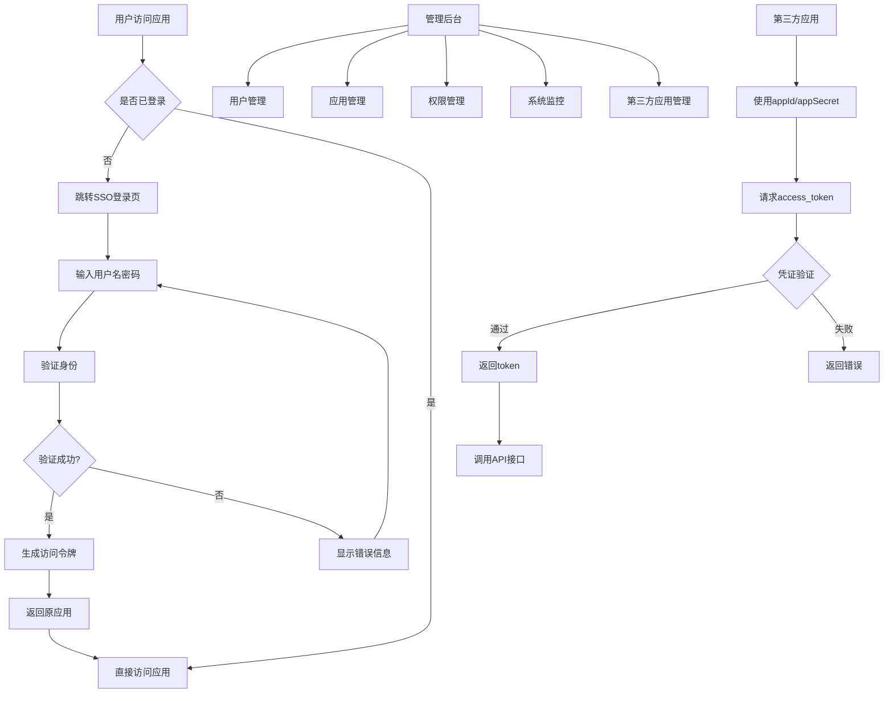

# SSO单点登录系统产品需求文档

## 1. Product Overview
SSO（Single Sign-On）单点登录系统是一个企业级身份认证和授权管理平台，允许用户通过一次登录访问多个相关应用系统。
- 解决企业内部多系统重复登录问题，提升用户体验和管理效率
- 面向企业IT管理员、开发者和终端用户，提供统一的身份认证服务
- 目标是成为企业数字化转型中的核心身份基础设施，支撑业务系统的安全接入

## 2. Core Features

### 2.1 User Roles
| Role | Registration Method | Core Permissions |
|------|---------------------|------------------|
| 系统管理员 | 系统初始化创建 | 系统配置、用户管理、应用管理、权限分配 |
| 应用管理员 | 系统管理员邀请 | 管理特定应用的用户权限和配置 |
| 第三方应用开发者 | 申请审核通过 | 创建第三方应用、管理appId/appSecret、查看API文档 |
| 普通用户 | 管理员创建或LDAP同步 | 登录访问已授权的应用系统 |

### 2.2 Feature Module
我们的SSO系统包含以下主要页面：
1. **登录页面**：统一登录入口、多因素认证、第三方登录集成
2. **用户控制台**：个人信息管理、应用访问入口、安全设置
3. **管理后台**：用户管理、应用管理、权限配置、系统监控
4. **应用注册页面**：新应用接入配置、OAuth客户端管理
5. **第三方应用管理页面**：第三方应用注册、appId/appSecret管理、token接口配置
6. **权限管理页面**：角色定义、权限分配、访问控制策略
7. **第三方登录配置页面**：登录提供商管理、OAuth配置、短信服务配置

### 2.3 Page Details
| Page Name | Module Name | Feature description |
|-----------|-------------|---------------------|
| 登录页面 | 认证模块 | 用户名密码登录、记住登录状态、忘记密码重置、多因素认证（短信/邮箱验证码）|
| 登录页面 | 第三方登录 | 支持微信、支付宝、钉钉、飞书、企业微信、谷歌、抖音等OAuth登录 |
| 登录页面 | 手机号登录 | 手机号+短信验证码登录、号码验证、验证码发送限制 |
| 登录页面 | 二维码登录 | 生成登录二维码、扫码状态检测、移动端确认登录 |
| 登录页面 | 域集成 | LDAP/AD域集成、企业统一身份认证 |
| 用户控制台 | 个人中心 | 查看修改个人信息、修改密码、查看登录历史、安全设置 |
| 用户控制台 | 应用门户 | 显示已授权应用列表、一键跳转到各应用系统、收藏常用应用 |
| 管理后台 | 用户管理 | 创建删除用户、批量导入用户、用户信息编辑、账户状态管理 |
| 管理后台 | 应用管理 | 注册新应用、配置应用信息、生成客户端密钥、应用状态管理 |
| 管理后台 | 权限管理 | 创建角色、分配权限、用户角色绑定、权限继承关系 |
| 管理后台 | 系统监控 | 登录统计、安全日志、系统性能监控、异常告警 |
| 应用注册页面 | OAuth配置 | 设置回调地址、选择授权范围、生成客户端凭证 |
| 权限管理页面 | 访问控制 | 定义资源权限、设置访问策略、IP白名单、时间限制 |
| 第三方登录配置页面 | 提供商管理 | 启用/禁用登录方式、OAuth应用配置、回调地址设置 |
| 第三方登录配置页面 | 服务配置 | 短信服务商配置、二维码服务配置、加密密钥管理 |
| 用户控制台 | 账号绑定管理 | 查看已绑定账号、解绑第三方账号、绑定新的第三方账号 |
| 第三方应用管理页面 | 应用注册 | 创建第三方应用、填写应用信息、生成appId和appSecret、设置应用权限范围 |
| 第三方应用管理页面 | 凭证管理 | 查看appId、重置appSecret、下载凭证文件、设置凭证有效期 |
| 第三方应用管理页面 | Token接口 | 配置token获取接口、设置token有效期、API调用频率限制 |
| 第三方应用管理页面 | 应用监控 | 查看API调用统计、token使用情况、异常日志、安全审计 |

## 3. Core Process

**普通用户流程：**
用户访问任意应用 → 检测登录状态 → 未登录则跳转SSO登录页 → 输入凭证完成认证 → 返回原应用并自动登录 → 访问其他应用时自动登录

**管理员流程：**
系统管理员登录 → 创建应用和用户 → 配置权限角色 → 分配用户权限 → 监控系统使用情况

**应用接入流程：**
开发者注册应用 → 获取客户端凭证 → 集成OAuth 2.0/OpenID Connect → 测试认证流程 → 上线使用

**第三方应用接入流程：**
第三方开发者申请接入 → 系统管理员审核通过 → 创建第三方应用 → 生成appId和appSecret → 配置API权限范围 → 集成token获取接口 → 测试API调用 → 正式上线

### 第三方登录流程（支持自定义重定向和授权码验证）

#### 标准OAuth 2.0授权码模式流程：
1. **发起授权请求**：用户选择第三方登录方式，系统生成state参数防CSRF攻击
2. **重定向到第三方**：系统构建授权URL并重定向用户到第三方授权页面
3. **用户授权**：用户在第三方平台完成身份验证和授权确认
4. **授权码回调**：第三方平台携带授权码(code)和state参数回调SSO系统
5. **验证授权码**：系统验证state参数，使用授权码向第三方换取访问令牌
6. **获取用户信息**：使用访问令牌获取第三方用户信息
7. **账号绑定/创建**：根据第三方用户信息绑定现有账号或创建新账号
8. **自定义重定向**：根据初始请求中的redirect_uri参数重定向到指定应用

#### 自定义重定向支持：
- 支持在登录请求中指定redirect_uri参数
- 系统验证重定向URL是否在应用白名单中
- 支持多级重定向和状态参数传递
- 登录成功后自动跳转到指定页面

#### 安全机制：
- state参数防止CSRF攻击
- 重定向URL白名单验证
- 授权码一次性使用和有效期限制
- 会话状态跟踪和超时处理

### 第三方应用Token获取流程

#### Client Credentials模式流程：
1. **应用认证**：第三方应用使用appId和appSecret向SSO系统发起token请求
2. **凭证验证**：系统验证appId和appSecret的有效性和权限范围
3. **生成Token**：验证通过后生成access_token，包含应用权限信息
4. **返回Token**：返回access_token、token类型、有效期等信息
5. **API调用**：第三方应用使用token调用SSO系统的API接口
6. **Token刷新**：token过期前可使用refresh_token获取新的access_token

#### appSecret重置流程：
1. **发起重置**：第三方应用管理员在管理页面点击重置appSecret
2. **身份验证**：系统要求进行二次身份验证（短信/邮箱验证码）
3. **生成新密钥**：系统生成新的appSecret并使旧密钥失效
4. **通知更新**：系统发送通知提醒更新应用配置
5. **宽限期**：提供24小时宽限期，期间新旧密钥都有效
6. **完全切换**：宽限期后旧密钥完全失效

#### 第三方应用安全机制：
- appSecret加密存储，不可逆加密
- API调用频率限制，防止恶意调用
- IP白名单验证，限制调用来源
- token有效期控制，默认2小时过期
- 异常行为监控，自动封禁可疑应用
- 审计日志记录，追踪所有API调用

## 4. User Interface Design
### 4.1 Design Style
- 主色调：深蓝色(#1890ff)，辅助色：浅灰色(#f5f5f5)
- 按钮样式：圆角按钮，主要按钮使用渐变效果
- 字体：系统默认字体，标题16px，正文14px，说明文字12px
- 布局风格：卡片式设计，左侧导航栏，响应式布局
- 图标风格：线性图标，统一使用Ant Design图标库

### 4.2 Page Design Overview

| Page Name | Module Name | UI Elements |
|-----------|-------------|-------------|
| 登录页面 | 登录表单 | 居中卡片布局，白色背景，品牌Logo，输入框圆角设计，蓝色登录按钮 |
| 登录页面 | 第三方登录区域 | 第三方登录按钮网格布局，图标+文字，悬停效果，分隔线设计 |
| 登录页面 | 登录方式切换 | Tab切换组件，支持密码/手机号/二维码登录切换 |
| 登录页面 | 二维码区域 | 二维码显示区域，刷新按钮，状态提示文字，倒计时显示 |
| 用户控制台 | 应用门户 | 网格布局展示应用图标，悬停效果，搜索筛选功能 |
| 用户控制台 | 账号绑定 | 第三方账号绑定状态，解绑操作，绑定新账号入口 |
| 管理后台 | 数据表格 | Element Plus表格组件，分页器，操作按钮，状态标签 |
| 管理后台 | 导航菜单 | 左侧折叠菜单，图标+文字，面包屑导航 |
| 管理后台 | 第三方登录配置 | 提供商开关，配置表单，测试连接按钮，状态指示器 |
| 第三方应用管理页面 | 应用列表 | 表格展示应用信息，状态标签，操作按钮，搜索筛选功能 |
| 第三方应用管理页面 | 应用详情 | 卡片布局显示appId，隐藏显示appSecret，重置按钮，权限配置 |
| 第三方应用管理页面 | 凭证重置 | 模态框确认，验证码输入，进度提示，成功通知 |
| 第三方应用管理页面 | API文档 | 接口说明，请求示例，响应格式，错误码说明 |

### 4.3 Responsiveness
系统采用桌面优先设计，同时支持移动端自适应，登录页面针对移动设备进行触摸优化。